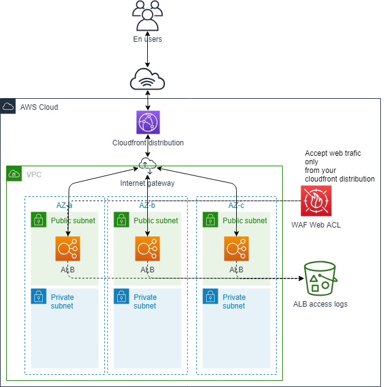
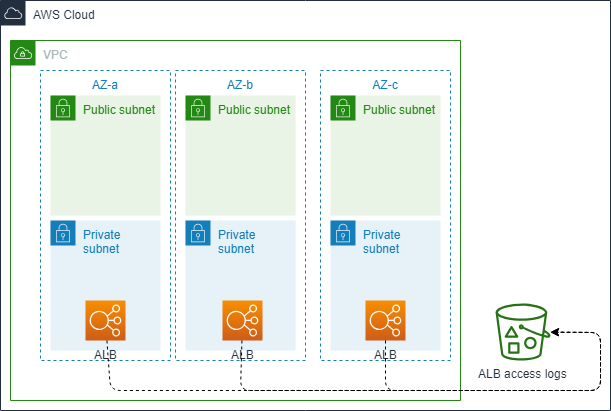

 

<h1 align="center">
    Terraform AWS LB Stack
</h1>

    This terraform module is design to implement configurable and secure ingress aws loadbalancer  
    alb  
    listener  
    target group  
    listener rules  
    weighted based routing  
    with support for both Application and Network LB

# AWS load balancer

## Description

This module allows you to deploy an ALB/NLB with all available parameters.

If you want to have an ALB/NLB in public subnets to be able to expose it on the internet, you have to set the variable "internal" to "false" (default: true). With this configuration your ALB will have publicly routable IP. Otherwise the ALB/NLB will be created in the private subnet of the VPC.

Using this module allows you to automatically create an AWS Security Group for inbound traffic with a rule for outbound traffic. By composing the alb module with the others submodule (ingress-listener and ingress-target-rules), you can have a full ingress alb.

Here is the list of AWS resources deployed by this Terraform module:

* 1 AWS ALB internal or external.
* 1 AWS Security Group
* 1 or more Alb listerner
* 1 target group
* 1 or more listener rules
* redirect http --> https
* fixed response for non-forwarded route

The module has been specialy crafted for use case such as :

* blue / green deployment
* host based and path based routing
* composability/flexibility
* integration with ecs target
* integration with lambda target

## providers

| Name      | Version |
| --------- | ------- |
| terraform | >= 1.0.4 |
| aws       | >= 3.15|

## Modules

### Module Reference

#### Core Modules

| Module                   | Completeness |                                Documentation |
| ------------------------ | :----------: | -------------------------------------------: |
| alb                      |    v3.4.0    |                      [README](alb/README.md) |
| alb-ingress-listener     |    v3.4.0    |     [README](alb-ingress-listener/README.md) |
| alb-ingress-target-rules |    v3.4.0    | [README](alb-ingress-target-rules/README.md) |
| alb-ingress-target-weighted-rules |    v3.4.0    | [README](alb-ingress-target-weighted-rules/README.md) |

#### Module dependency

| Module                   |  alb  | alb-ingress-listener | alb-ingress-target-rules |
| ------------------------ | :---: | :------------------: | :----------------------: |
| alb                      |       |                      |                          |
| alb-ingress-listener     |   x   |                      |                          |
| alb-ingress-target-rules |   x   |          x           |                          |

## Architecture design

### External ALB

If you set the "internal" variable to "false" your ALB becomes publicly accessible (external) and will be deployed in public subnets. Therefore, your ALB will be deployed with an AWS WAF Web ACL to only accept traffic from your Cloudfront distribution.

(to modify this diagram you can find xml draw.io file [here](docs/external_alb.xml))

### Internal ALB

If you set the variable "internal" to "true" your ALB will be deployed in private subnets and will not be publicly accessible. You will not need cloudfront distribution or WAF Web ACL.

(to modify this diagram you can find xml draw.io file [here](docs/internal_alb.xml))

## Release notes

Release notes are available [here](https://gitlab.cmacgm.com/cloud-devops/terraform-modules/alb/-/releases).

## Bug Reports & Feature Requests

Bug reports & feature requests should be reported in gitlab [here (link to update)](??/issues), before submitting an issue or a merge request, please check our [submission guidlines](CONTRIBUTING.md)

## Contributing

The CloudFoundation is a small team that cannot garantee maintaining and imporving all ouf our terraform module portofilio. To build more comprehensive & better terraform modules by adding and laveraging features that meet your business cases, we need your contribution to maintain & move toward our DevOps accelerator portofolio.

We are adopting an open source approach, where **every single Dev(Ops) @** can "Commit" to **every terraform module**, we are confident this approach will lead to higher-quality modules but also will make it easier to use thoses modules.

**You want to participate ?** Checkout our guidlines for [contributing](CONTRIBUTING.md).
